

<picture>
  <source media="(prefers-color-scheme: dark)" srcset="header/name-dark.svg">
  <source media="(prefers-color-scheme: light)" srcset="header/name-light.svg">
  
</picture>

<!-- AWAKEN:START -->
<!-- Generated by git-profile-awaken. Edit awaken.json instead of this block. -->

<a href="https://haminhtri-website.vercel.app"><picture><source media="(prefers-color-scheme: dark)" srcset="awaken/contact-1-website-dark.svg"><source media="(prefers-color-scheme: light)" srcset="awaken/contact-1-website-light.svg"></picture></a>
<a href="https://www.linkedin.com/in/tri-ha-195374250/"><picture><source media="(prefers-color-scheme: dark)" srcset="awaken/contact-2-linkedin-dark.svg"><source media="(prefers-color-scheme: light)" srcset="awaken/contact-2-linkedin-light.svg"></picture></a>
<a href="mailto:trihaminh2004@gmail.com"><picture><source media="(prefers-color-scheme: dark)" srcset="awaken/contact-3-email-dark.svg"><source media="(prefers-color-scheme: light)" srcset="awaken/contact-3-email-light.svg"></picture></a>
<a href="https://github.com/tuilatri"><picture><source media="(prefers-color-scheme: dark)" srcset="awaken/contact-4-github-dark.svg"><source media="(prefers-color-scheme: light)" srcset="awaken/contact-4-github-light.svg"></picture></a>

<picture><source media="(prefers-color-scheme: dark)" srcset="awaken/status-dark.svg"><source media="(prefers-color-scheme: light)" srcset="awaken/status-light.svg"></picture>

<picture><source media="(prefers-color-scheme: dark)" srcset="awaken/banner-dark.svg"><source media="(prefers-color-scheme: light)" srcset="awaken/banner-light.svg"></picture>

<picture><source media="(prefers-color-scheme: dark)" srcset="awaken/bio-dark.svg"><source media="(prefers-color-scheme: light)" srcset="awaken/bio-light.svg"></picture>
<a href="https://haminhtri-website.vercel.app/documents/resume.pdf"><picture><source media="(prefers-color-scheme: dark)" srcset="awaken/career-dark.svg"><source media="(prefers-color-scheme: light)" srcset="awaken/career-light.svg"></picture></a>

<picture><source media="(prefers-color-scheme: dark)" srcset="awaken/skills-dark.svg"><source media="(prefers-color-scheme: light)" srcset="awaken/skills-light.svg"></picture>
<picture><source media="(prefers-color-scheme: dark)" srcset="awaken/oracle-dark.svg"><source media="(prefers-color-scheme: light)" srcset="awaken/oracle-light.svg"></picture>

<picture><source media="(prefers-color-scheme: dark)" srcset="awaken/achievements-dark.svg"><source media="(prefers-color-scheme: light)" srcset="awaken/achievements-light.svg"></picture>

<picture><source media="(prefers-color-scheme: dark)" srcset="awaken/activity-dark.svg"><source media="(prefers-color-scheme: light)" srcset="awaken/activity-light.svg"></picture>

<!-- AWAKEN:END -->

<picture><source media="(prefers-color-scheme: dark)" srcset="header/sec-title-tech-stack-dark.svg"><source media="(prefers-color-scheme: light)" srcset="header/sec-title-tech-stack-light.svg"></picture>

<picture><source media="(prefers-color-scheme: dark)" srcset="header/sec-label-languages-dark.svg"><source media="(prefers-color-scheme: light)" srcset="header/sec-label-languages-light.svg"></picture>

<picture><source media="(prefers-color-scheme: dark)" srcset="header/grid-languages-dark.svg"><source media="(prefers-color-scheme: light)" srcset="header/grid-languages-light.svg">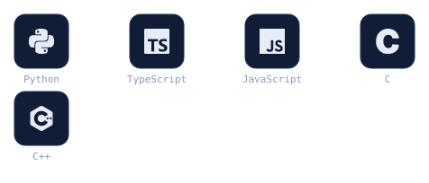</picture>

<picture><source media="(prefers-color-scheme: dark)" srcset="header/sec-label-frontend-dark.svg"><source media="(prefers-color-scheme: light)" srcset="header/sec-label-frontend-light.svg"></picture>

<picture><source media="(prefers-color-scheme: dark)" srcset="header/grid-frontend-dark.svg"><source media="(prefers-color-scheme: light)" srcset="header/grid-frontend-light.svg">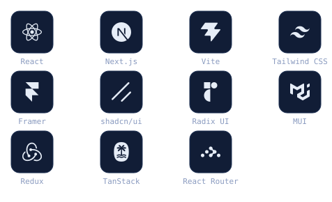</picture>

<picture><source media="(prefers-color-scheme: dark)" srcset="header/sec-label-backend-dark.svg"><source media="(prefers-color-scheme: light)" srcset="header/sec-label-backend-light.svg"></picture>

<picture><source media="(prefers-color-scheme: dark)" srcset="header/grid-backend-dark.svg"><source media="(prefers-color-scheme: light)" srcset="header/grid-backend-light.svg">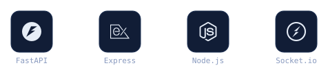</picture>

<picture><source media="(prefers-color-scheme: dark)" srcset="header/sec-label-ai-ml-dark.svg"><source media="(prefers-color-scheme: light)" srcset="header/sec-label-ai-ml-light.svg"></picture>

<picture><source media="(prefers-color-scheme: dark)" srcset="header/grid-ai-ml-dark.svg"><source media="(prefers-color-scheme: light)" srcset="header/grid-ai-ml-light.svg">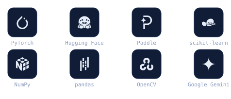</picture>

<picture><source media="(prefers-color-scheme: dark)" srcset="header/sec-label-data-dark.svg"><source media="(prefers-color-scheme: light)" srcset="header/sec-label-data-light.svg"></picture>

<picture><source media="(prefers-color-scheme: dark)" srcset="header/grid-data-dark.svg"><source media="(prefers-color-scheme: light)" srcset="header/grid-data-light.svg">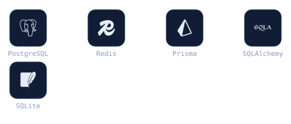</picture>

<picture><source media="(prefers-color-scheme: dark)" srcset="header/sec-label-cloud-devops-dark.svg"><source media="(prefers-color-scheme: light)" srcset="header/sec-label-cloud-devops-light.svg"></picture>

<picture><source media="(prefers-color-scheme: dark)" srcset="header/grid-cloud-devops-dark.svg"><source media="(prefers-color-scheme: light)" srcset="header/grid-cloud-devops-light.svg">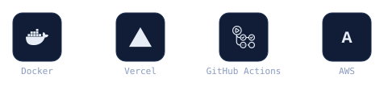</picture>

<picture><source media="(prefers-color-scheme: dark)" srcset="header/sec-label-testing-dark.svg"><source media="(prefers-color-scheme: light)" srcset="header/sec-label-testing-light.svg"></picture>

<picture><source media="(prefers-color-scheme: dark)" srcset="header/grid-testing-dark.svg"><source media="(prefers-color-scheme: light)" srcset="header/grid-testing-light.svg">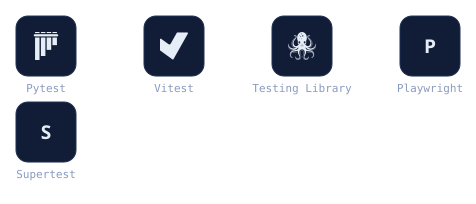</picture>

<picture><source media="(prefers-color-scheme: dark)" srcset="header/sec-label-tools-dark.svg"><source media="(prefers-color-scheme: light)" srcset="header/sec-label-tools-light.svg"></picture>

<picture><source media="(prefers-color-scheme: dark)" srcset="header/grid-tools-dark.svg"><source media="(prefers-color-scheme: light)" srcset="header/grid-tools-light.svg">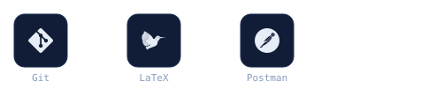</picture>

<picture><source media="(prefers-color-scheme: dark)" srcset="header/sec-title-active-quests-dark.svg"><source media="(prefers-color-scheme: light)" srcset="header/sec-title-active-quests-light.svg"></picture>

| Project | What it is | Stack |
|:---:|:---:|:---:|
| [Amazon-Clone](https://github.com/tuilatri/Amazon_Clone) · [demo](https://amazon-clone-2xzu.vercel.app/) | Graduation thesis — multi-vendor marketplace with 12 recommendation models (LightGCN, two-tower, iALS, item2vec, cross-encoder, hybrid RRF ranker), wallet + payments, logistics | React, FastAPI, PostgreSQL, PyTorch, FAISS |
| [Trello-Clone](https://github.com/tuilatri/Trello_Clone) | Realtime kanban with drag-and-drop, Gantt + critical path, Butler automation, AI agent that proposes and executes actions | React, Express, Prisma, Socket.IO, pgvector, Vercel AI SDK |
| [Document Intelligence Pipeline](https://github.com/tuilatri/Document-Intelligence-Pipeline) | Invoice intelligence: OCR → LLM extraction → code-side validation, RAG + guarded text-to-SQL, PII encrypted at rest, 600+ tests | FastAPI, pgvector, PaddleOCR, Next.js, QLoRA |
| [OCR Scanning](https://github.com/tuilatri/OCR_Scanning) · Enterprise | Signs and stamps Vietnamese administrative documents; OCR only locates anchor coordinates. AES-256-GCM, Argon2id, MFA, HMAC-signed API | FastAPI, PaddleOCR, PyMuPDF, React, Vite |
| [Dining Verse](https://github.com/tuilatri/online-restaurant-system) · [demo](https://online-restaurant-system-hugo.vercel.app/) | Online food ordering with live SSE kitchen display, modifiers, vouchers, flash sales | React, Express, Prisma, PostgreSQL, SSE |
| [Weather Application](https://github.com/tuilatri/weather-application) · [demo](https://weather-application-hugo.vercel.app/) | Built during the AWS Vietnam cloud trainee programme | JavaScript |
