

# Hà Minh Trí

### Connect with the Player

### Active Quests

| Project | What it is | Stack |
|---|---|---|
| [Amazon-Clone](https://github.com/tuilatri/Amazon_Clone) · [demo](https://amazon-clone-2xzu.vercel.app/) | Graduation thesis — multi-vendor marketplace with 12 recommendation models (LightGCN, two-tower, iALS, item2vec, cross-encoder, hybrid RRF ranker), wallet + payments, logistics | React, FastAPI, PostgreSQL, PyTorch, FAISS |
| [Trello-Clone](https://github.com/tuilatri/Trello_Clone) | Realtime kanban with drag-and-drop, Gantt + critical path, Butler automation, AI agent that proposes and executes actions | React, Express, Prisma, Socket.IO, pgvector, Vercel AI SDK |
| [Document Intelligence Pipeline](https://github.com/tuilatri/Document-Intelligence-Pipeline) | Invoice intelligence: OCR → LLM extraction → code-side validation, RAG + guarded text-to-SQL, PII encrypted at rest, 600+ tests | FastAPI, pgvector, PaddleOCR, Next.js, QLoRA |
| [OCR Scanning](https://github.com/tuilatri/OCR_Scanning) · Enterprise | Signs and stamps Vietnamese administrative documents; OCR only locates anchor coordinates. AES-256-GCM, Argon2id, MFA, HMAC-signed API | FastAPI, PaddleOCR, PyMuPDF, React, Vite |
| [Dining Verse](https://github.com/tuilatri/online-restaurant-system) · [demo](https://online-restaurant-system-hugo.vercel.app/) | Online food ordering with live SSE kitchen display, modifiers, vouchers, flash sales | React, Express, Prisma, PostgreSQL, SSE |
| [Weather Application](https://github.com/tuilatri/weather-application) · [demo](https://weather-application-hugo.vercel.app/) | Built during the AWS Vietnam cloud trainee programme | JavaScript |

<!-- AWAKEN:START -->
<!-- Generated by git-profile-awaken. Edit awaken.json instead of this block. -->

<picture><source media="(prefers-color-scheme: dark)" srcset="awaken/hunter-dark.svg"><source media="(prefers-color-scheme: light)" srcset="awaken/hunter-light.svg"></picture>

<picture><source media="(prefers-color-scheme: dark)" srcset="awaken/ladder-dark.svg"><source media="(prefers-color-scheme: light)" srcset="awaken/ladder-light.svg"></picture>

<picture><source media="(prefers-color-scheme: dark)" srcset="awaken/web-dark.svg"><source media="(prefers-color-scheme: light)" srcset="awaken/web-light.svg"></picture>
<picture><source media="(prefers-color-scheme: dark)" srcset="awaken/skills-dark.svg"><source media="(prefers-color-scheme: light)" srcset="awaken/skills-light.svg"></picture>

<picture><source media="(prefers-color-scheme: dark)" srcset="awaken/activity-dark.svg"><source media="(prefers-color-scheme: light)" srcset="awaken/activity-light.svg"></picture>

<picture><source media="(prefers-color-scheme: dark)" srcset="awaken/quest-dark.svg"><source media="(prefers-color-scheme: light)" srcset="awaken/quest-light.svg"></picture>
<picture><source media="(prefers-color-scheme: dark)" srcset="awaken/contribution-dark.svg"><source media="(prefers-color-scheme: light)" srcset="awaken/contribution-light.svg"></picture>

<a href="https://github.com/tuilatri/PPL_Finance_Chatbot_01"><picture><source media="(prefers-color-scheme: dark)" srcset="awaken/spotlight-1-dark.svg"><source media="(prefers-color-scheme: light)" srcset="awaken/spotlight-1-light.svg"></picture></a>
<a href="https://github.com/tuilatri/Flims_Mining"><picture><source media="(prefers-color-scheme: dark)" srcset="awaken/spotlight-2-dark.svg"><source media="(prefers-color-scheme: light)" srcset="awaken/spotlight-2-light.svg"></picture></a>

<picture><source media="(prefers-color-scheme: dark)" srcset="awaken/oracle-dark.svg"><source media="(prefers-color-scheme: light)" srcset="awaken/oracle-light.svg"></picture>
<picture><source media="(prefers-color-scheme: dark)" srcset="awaken/daily-dark.svg"><source media="(prefers-color-scheme: light)" srcset="awaken/daily-light.svg"></picture>

<picture><source media="(prefers-color-scheme: dark)" srcset="awaken/rune-str-dark.svg"><source media="(prefers-color-scheme: light)" srcset="awaken/rune-str-light.svg"></picture>
<picture><source media="(prefers-color-scheme: dark)" srcset="awaken/rune-agi-dark.svg"><source media="(prefers-color-scheme: light)" srcset="awaken/rune-agi-light.svg"></picture>
<picture><source media="(prefers-color-scheme: dark)" srcset="awaken/rune-int-dark.svg"><source media="(prefers-color-scheme: light)" srcset="awaken/rune-int-light.svg"></picture>
<picture><source media="(prefers-color-scheme: dark)" srcset="awaken/rune-vit-dark.svg"><source media="(prefers-color-scheme: light)" srcset="awaken/rune-vit-light.svg"></picture>

<picture><source media="(prefers-color-scheme: dark)" srcset="awaken/rune-luk-dark.svg"><source media="(prefers-color-scheme: light)" srcset="awaken/rune-luk-light.svg"></picture>
<picture><source media="(prefers-color-scheme: dark)" srcset="awaken/rune-cha-dark.svg"><source media="(prefers-color-scheme: light)" srcset="awaken/rune-cha-light.svg"></picture>

<!-- AWAKEN:END -->